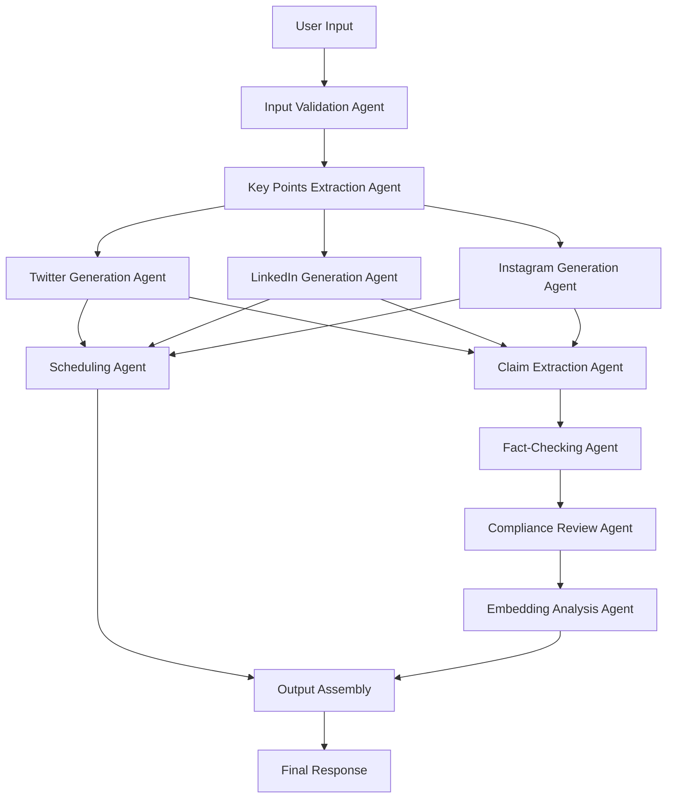

# Content Workflow Agent - AI Architecture & Process Flow

## Overview

The Content Workflow Agent is a sophisticated AI system that orchestrates multiple specialized AI agents and language models to transform blog content into optimized social media posts. 

**What it does**: Converts long-form blog content into platform-specific social media posts
**Why this approach**: Manual content adaptation is time-consuming and often lacks consistency across platforms
**How it works**: Uses multiple AI agents working together, each specialized for specific tasks like content extraction, fact-checking, and platform optimization

**Multi-Agent Architecture Definition**: A system where different AI components handle specialized tasks rather than one large AI trying to do everything. This approach provides:
- **Better accuracy**: Each agent focuses on what it does best
- **Easier maintenance**: Problems can be isolated to specific agents
- **Scalability**: New platforms or features can be added as new agents
- **Quality control**: Multiple validation steps ensure better output

This document provides an in-depth analysis of all AI components, their interactions, and the complete data flow from input to output.

## Core Language Model

### Primary LLM: OpenAI GPT-4o

**What it is**: GPT-4 Optimized (`gpt-4o`) is OpenAI's most advanced language model
**Why we chose it**: Released May 13, 2024, it provides the best balance of reasoning capability, factual accuracy, and processing speed
**Technical specifications**:
- **Context Window**: 128,000 tokens (roughly 96,000 words)
  - **Why this matters**: Allows processing of very long blog posts without truncation
  - **Definition**: Context window is how much text the AI can "remember" and work with at once
- **Temperature Settings**: 0.3 
  - **What temperature means**: Controls randomness in AI responses (0 = very consistent, 1 = very creative)
  - **Why 0.3**: Provides consistency and factual accuracy while allowing some natural language variation
- **API Integration**: OpenAI Chat Completions API
  - **Why API approach**: Ensures we always use the latest model version and don't need local hardware

**Role in the system**: Primary reasoning and content generation engine that powers most agents

### Embedding Model: OpenAI text-embedding-3-small

**What it is**: A specialized AI model that converts text into numerical vectors (arrays of numbers)
**Why embeddings matter**: They allow computers to understand semantic meaning and measure how similar two pieces of text are
**Technical specifications**:
- **Model**: `text-embedding-3-small`
- **Dimensions**: 1,536 (each piece of text becomes a list of 1,536 numbers)
  - **Why 1,536 dimensions**: Provides rich semantic representation while being computationally efficient
- **Purpose**: Semantic similarity analysis and content alignment scoring
  - **Definition of semantic similarity**: How similar two texts are in meaning, not just words

**Use cases in our system**:
- **Content quality assessment**: Measuring how well generated posts match original content
- **Similarity detection**: Finding duplicate or overly similar content
- **Gap analysis**: Identifying important concepts missing from generated posts

## AI Agent Architecture

**What is an AI agent**: A specialized software component that uses artificial intelligence to perform a specific task autonomously
**Why use multiple agents**: Instead of one large AI trying to do everything, we use specialized agents because:
- Each agent becomes expert at its specific task
- Easier to debug and improve individual components
- Better quality control through multiple validation steps
- More reliable overall system performance

**LangGraph-based workflow orchestration**:
- **What LangGraph is**: A framework for building multi-step AI workflows where agents pass information between each other
- **Why we chose it**: Provides reliable orchestration, error handling, and allows complex workflows with conditional logic
- **How it works**: Agents are connected in a graph structure where each node represents an AI agent and edges represent data flow

**Agent definition**: Each agent is a focused AI component with specific responsibilities, clear inputs, and predictable outputs.

## Complete Workflow Process

### Phase 1: Input Processing & Validation

#### Input Agent

**What this agent does**: Validates and preprocesses user input before any AI processing begins
**Why this step is crucial**: Invalid input can cause expensive API calls to fail or produce poor results. By validating first, we ensure reliable processing and better user experience
**When it runs**: First step in the entire workflow, before any other agent processes the content
**Why input validation is crucial**: 
- Prevents system errors from malformed input
- Ensures consistent data format for downstream agents
- Protects against potential security issues
- Provides early feedback to users about input problems

**Input received**: 
- **Raw blog text**: Minimum 100 characters required
  - **Why 100 characters minimum**: Shorter text doesn't provide enough context for meaningful social media post generation
- **Optional topic hint string**: User-provided context about the content theme
  - **Purpose of topic hint**: Helps AI agents better understand context and generate more targeted hashtags and content

**Processing steps explained**:
1. **Text length validation**: 
   - **What**: Checks if input meets minimum requirements
   - **Why**: Ensures sufficient content for meaningful processing
2. **Encoding safety checks**:
   - **What**: Verifies text is properly encoded and readable
   - **Why**: Prevents processing errors from corrupted or incompatible text formats
3. **Topic hint normalization**:
   - **What**: Standardizes topic hint format and removes invalid characters
   - **Why**: Ensures consistent processing by downstream agents
4. **State initialization**:
   - **What**: Creates the data structure that will carry information through all agents
   - **Why**: Establishes the "state" that tracks progress and results through the entire workflow

**Output structure explained**:
```python
State = {
    "text": "validated_blog_content",           # Cleaned, validated blog content
    "topic_hint": "normalized_topic",        # Standardized topic hint
    "key_points": [],                        # Will store extracted insights
    "drafts": {},                            # Will store platform-specific posts
    "claims": {},                            # Will store factual claims for checking
    "reviews": {},                           # Will store compliance review results
    "timings": [],                           # Will store optimal posting times
    "errors": [],                            # Will track any processing errors
    "embedding_analysis": {}                 # Will store semantic analysis results
}
```

**Why this state structure**: Acts as a shared data container that every agent can read from and write to, ensuring information flows correctly through the entire process.

### Phase 2: Content Analysis & Extraction

#### Key Points Extraction Agent

**What this agent does**: Extracts 5-8 key insights from blog content using advanced prompt engineering
**Why key point extraction is essential**:
- Social media posts are much shorter than blog posts, so we need to identify the most important information
- Different platforms have different character limits, requiring prioritized content
- Users want the "highlights" that will engage their audience most effectively

**Input received**: 
- **Blog text**: Up to 8,000 tokens (approximately 6,000 words)
  - **Why 8,000 token limit**: GPT-4o can handle much more, but this ensures fast processing and focused analysis
  - **Token definition**: A token is roughly 3/4 of a word; it's how AI models measure text length
- **Extraction prompt template**: Pre-designed instructions that tell the AI exactly how to extract insights

**AI Model Used**: GPT-4o with JSON response format
**Why GPT-4o for this task**: 
- Excellent at understanding context and identifying important information
- Can follow complex instructions reliably
- JSON response format ensures structured, parseable output

**Prompt Strategy Explained**: 
```
Extract 5–8 key bullet points from the blog text below. 
Preserve numbers, dates, entities. No marketing fluff.
Return JSON array with importance scoring (0-1 scale).
```

**Why this prompt works**:
- **"5-8 key bullet points"**: Specific number prevents too much or too little content
- **"Preserve numbers, dates, entities"**: Ensures factual accuracy and specificity
- **"No marketing fluff"**: Focuses on substance over promotional language
- **"JSON array"**: Ensures structured output that can be programmatically processed
- **"Importance scoring"**: Allows prioritization for different platform needs

**Processing Steps Explained**:
1. **Text tokenization and length management**:
   - **What**: Breaks text into tokens and truncates if too long
   - **Why**: Ensures the AI model can process the content efficiently
2. **Structured prompt construction**:
   - **What**: Combines the blog text with extraction instructions
   - **Why**: Gives the AI clear, consistent instructions for every request
3. **GPT-4o API call with temperature=0.3**:
   - **What**: Sends the request to OpenAI's servers
   - **Why temperature 0.3**: Ensures consistent, factual extraction while allowing natural language
4. **JSON parsing and validation**:
   - **What**: Converts AI response into structured data and checks for errors
   - **Why**: Ensures the output can be used by other agents in the system
5. **Importance score normalization**:
   - **What**: Ensures all importance scores are between 0 and 1
   - **Why**: Provides consistent prioritization across all content types

**Output Structure Explained**:
```python
KeyPoint = {
    "text": "Specific factual insight",    # The actual insight extracted
    "importance": 0.8                 # Priority score (0=low, 1=high priority)
}
```

**Why importance scoring matters**: Different platforms need different amounts of content, so we prioritize the most important insights for shorter formats like Twitter.

**Error Handling Strategy**: 
- **Graceful fallback**: If JSON parsing fails, uses alternative text parsing
- **Retry logic**: Attempts the request again with modified parameters if it fails
- **Alternative parsing**: Can extract insights even if the AI doesn't follow the exact format requested

### Phase 3: Multi-Platform Content Generation

#### Platform-Specific Generation Agents

**What this phase does**: Creates tailored content for each social media platform
**Why platform-specific agents**: Each social media platform has different:
- Character limits and formatting rules
- Audience expectations and communication styles
- Optimal content types and engagement patterns
- Technical features (threads, hashtags, mentions)

**Multi-agent approach benefit**: Instead of one agent trying to understand all platforms, each agent specializes in one platform's unique requirements and best practices.

##### Twitter Generation Agent

**What this agent does**: Creates Twitter-optimized posts with optional threads
**Why Twitter needs special handling**:
- Strict 280 character limit requires precise wording
- Fast-moving timeline means content must be immediately engaging
- Thread feature allows for longer content in connected tweets
- Hashtags and mentions drive discoverability

**Input received**: 
- **Key points array**: Prioritized insights from the extraction phase
  - **Why needed**: Must fit most important information within character limits
- **Topic hint**: Context for better hashtag and mention generation
  - **Why important**: Helps generate relevant, targeted hashtags rather than generic ones
- **Platform constraints**: 280 character limit per tweet
  - **Why this matters**: Hard technical limit that cannot be exceeded

**AI Model Used**: GPT-4o with conditional language prompts
**Why GPT-4o for Twitter**: 
- Excellent at concise, engaging writing
- Understands Twitter's informal but informative tone
- Can optimize for character limits while maintaining meaning

**Twitter Processing Steps Explained**:
1. **Character limit optimization**:
   - **What**: Ensures content fits within Twitter's 280 character limit
   - **Why**: Twitter hard-rejects posts that exceed this limit
   - **How**: Uses advanced text compression while preserving meaning
2. **Hashtag generation (3-5 targeted tags)**:
   - **What**: Creates relevant hashtags that increase discoverability
   - **Why**: Hashtags help people find your content in Twitter searches
   - **Strategy**: Focuses on specific, less-crowded hashtags rather than generic popular ones
3. **Optional thread creation (3-5 tweets)**:
   - **What**: Breaks longer content into connected tweets
   - **Why**: Allows sharing complex ideas while respecting character limits
   - **Logic**: Each tweet must be engaging on its own while contributing to the overall narrative
4. **Mention validation against verified handles**:
   - **What**: Suggests real, active Twitter accounts to mention
   - **Why**: Mentioning relevant people increases engagement and builds relationships
   - **Safety**: Only suggests verified or well-known accounts to avoid spam
5. **Engagement optimization**:
   - **What**: Uses language patterns that historically perform well on Twitter
   - **Why**: Optimizes for likes, retweets, and replies
   - **Techniques**: Questions, controversial but respectful takes, actionable insights

**Output Structure Explained**:
```python
TwitterPost = {
    "primary_text": "Main tweet ≤280 chars",          # The core tweet content
    "thread": ["Tweet 1", "Tweet 2", "Tweet 3"],      # Additional connected tweets (if needed)
    "hashtags": ["#specific", "#targeted"],           # Relevant hashtags for discoverability
    "mentions": ["@verified_handle"]                  # Relevant account mentions
}
```

**Why this structure**: Separates different elements so they can be combined flexibly and validated independently.

##### LinkedIn Generation Agent

**What this agent does**: Creates professional LinkedIn posts optimized for business networking
**Why LinkedIn needs different approach**:
- Professional audience expects business-focused, authority-building content
- Longer format allows for more detailed insights and analysis
- Business networking context requires different tone and language
- Career and industry focus drives engagement patterns

**Input received**: 
- **Key points array**: Same prioritized insights, but adapted for professional context
- **Topic hint**: Used to generate business-relevant hashtags and professional angles
- **Platform constraints**: 500-1200 characters optimal range
  - **Why this range**: Short enough for quick reading, long enough for substantial insights
  - **Why minimum 500**: LinkedIn audience expects more depth than Twitter
  - **Why maximum 1200**: Longer posts see decreased engagement

**AI Model Used**: GPT-4o with professional tone prompts
**Why specialized prompts**: LinkedIn requires formal but engaging business language that builds professional credibility

**Processing Steps Explained**:
1. **Professional tone optimization**:
   - **What**: Adapts language for business context while remaining engaging
   - **Why critical**: LinkedIn audience judges content by professional credibility
2. **Line break formatting for readability**:
   - **What**: Structures content with strategic line breaks and spacing
   - **Why important**: LinkedIn's interface requires good formatting for visual appeal
3. **Business-focused hashtag generation**:
   - **What**: Creates hashtags relevant to professional topics and industries
   - **Why different**: Business hashtags drive professional networking and industry discussions
   - **Strategy**: Uses industry-specific terms and professional development themes
4. **Authority-building language**:
   - **What**: Uses professional terminology and demonstrates expertise
   - **Why important**: LinkedIn users follow thought leaders and industry experts
   - **How**: Shares insights rather than basic information, cites experience and results
5. **Call-to-action integration**:
   - **What**: Includes professional networking requests or business-oriented actions
   - **Why effective**: LinkedIn is designed for professional networking and business development
   - **Examples**: "What's your experience with X?", "Share your thoughts on Y", "Connect if you're interested in Z"
   - **What**: Uses phrasing that positions the poster as knowledgeable and credible
   - **Why essential**: LinkedIn success depends on perceived professional expertise
5. **Call-to-action integration**:
   - **What**: Includes prompts for professional engagement (comments, connections, sharing)
   - **Why needed**: Drives professional networking and business development

**Output Structure Explained**:
```python
LinkedInPost = {
    "primary_text": "Professional content 500-1200 chars",    # Business-focused main content
    "hashtags": ["#business", "#professional"],              # Industry-relevant hashtags
    "mentions": ["@company"]                                 # Relevant business accounts
}
```

##### Instagram Generation Agent

**What this agent does**: Creates visual-friendly Instagram captions that complement images
**Why Instagram requires unique approach**:
- Visual-first platform where captions support images
- Community-focused audience values personal connection and storytelling
- Higher tolerance for longer captions and many hashtags
- Emphasis on lifestyle, inspiration, and emotional connection

**Input received**: 
- **Key points array**: Adapted for visual storytelling and personal connection
- **Topic hint**: Used for lifestyle-relevant hashtags and community building
- **Platform constraints**: 125-2200 characters range
  - **Why 125 minimum**: Ensures substantial content that adds value to the image
  - **Why 2200 maximum**: Instagram's technical limit, but also attention span consideration

**AI Model Used**: GPT-4o with engaging tone prompts
**Why engaging tone**: Instagram values authentic, warm communication that builds community connections

**Processing Steps Explained**:
1. **Visual storytelling optimization**:
   - **What**: Writes captions that complement and enhance visual content
   - **Why essential**: Instagram is visual-first; captions must add value to images
2. **Warm, engaging tone**:
   - **What**: Uses friendly, approachable language that feels personal and authentic
   - **Why important**: Instagram audience values genuine, relatable communication
3. **Community-building language**:
   - **What**: Includes phrases that encourage interaction and build connections
   - **Why critical**: Instagram success depends on community engagement and relationship building
4. **Extended hashtag strategy (up to 10)**:
   - **What**: Uses more hashtags than other platforms to maximize discoverability
   - **Why 10 hashtags**: Instagram allows 30, but 8-12 is optimal for engagement without appearing spammy
5. **Single clear call-to-action**:
   - **What**: One specific request for engagement (like, comment, follow, visit profile)
   - **Why single**: Multiple calls-to-action confuse users and reduce conversion rates

**Output Structure Explained**:
```python
InstagramPost = {
    "primary_text": "Engaging caption 125-2200 chars",       # Visual storytelling content
    "hashtags": ["#visual", "#lifestyle", "#community"],     # Lifestyle and community hashtags
    "mentions": ["@influencer"]                              # Relevant lifestyle/community accounts
}
```

**Why different hashtag strategies across platforms**: Each platform's algorithm and user behavior patterns reward different hashtag approaches - professional vs. lifestyle vs. news-focused.

### Phase 4: Fact-Checking & Verification

**What this phase does**: Identifies and verifies factual claims to ensure content accuracy
**Why fact-checking is critical**:
- Misinformation spreads quickly on social media
- False claims damage credibility and trust
- Some industries (healthcare, finance) have legal requirements for accuracy
- Users rely on content creators to provide accurate information

#### Claim Extraction Agent

**What this agent does**: Identifies factual claims requiring verification from both original content and generated posts
**Why extract claims separately**: 
- Generated posts might introduce new claims not in the original
- AI generation can sometimes create plausible-sounding but false statistics
- Different platforms might emphasize different facts requiring verification

**Input received**: 
- **Original blog text**: Source material that may contain factual claims
  - **Why needed**: Original claims must be verified for accuracy
- **Generated social media posts**: AI-created content that might contain new or modified claims
  - **Why important**: AI can sometimes hallucinate or misinterpret statistics

**AI Model Used**: GPT-4o with claim detection prompts
**Why GPT-4o for claim detection**: 
- Excellent at distinguishing factual claims from opinions
- Can identify subtle statistical claims embedded in narrative text
- Understands context to avoid flagging obvious non-factual statements

**Processing Steps Explained**:
1. **Factual statement identification**:
   - **What**: Distinguishes facts from opinions, speculation, or general statements
   - **Why important**: Only factual claims need verification; opinions cannot be fact-checked
   - **Example**: "Sales increased 25%" (factual) vs "This is an exciting development" (opinion)
2. **Statistical claim extraction**:
   - **What**: Identifies specific numbers, percentages, dates, and quantities
   - **Why critical**: Statistical claims are most verifiable and most damaging if wrong
   - **Example**: "48% of workers", "increased by $2 million", "since 2019"
3. **Source attribution analysis**:
   - **What**: Checks if claims already include source citations
   - **Why useful**: Pre-attributed claims are easier to verify and more credible
4. **Severity classification (low/medium/high)**:
   - **What**: Ranks how important verification is for each claim
   - **Why needed**: Allows prioritizing verification efforts on most critical claims
   - **High severity**: Specific statistics, health claims, financial data
   - **Medium severity**: General trends, approximate figures
   - **Low severity**: Widely known facts, obvious statements
5. **Deduplication across platforms**:
   - **What**: Removes duplicate claims that appear in multiple posts
   - **Why efficient**: Avoids verifying the same fact multiple times

**Output Structure Explained**:
```python
Claim = {
    "text": "48% of knowledge workers are working remotely",    # The exact claim to verify
    "severity": "high",                                   # How critical verification is
    "confidence": 0.0,                                   # Will be filled by verification agent
    "sources": []                                        # Will be filled by verification agent
}
```

**Why this structure**: Separates the identification of claims from their verification, allowing the verification agent to focus solely on finding evidence.

#### Fact-Checking Agent

**What this agent does**: Verifies claims against external sources using multiple search providers
**Why fact-checking is essential**: 
- Sharing false information damages credibility and can harm audiences
- Social media amplifies misinformation quickly
- Legal liability exists for certain types of false claims
- Building trust requires consistent accuracy

**Input received**: 
- **Array of extracted claims**: Facts identified by the claim extraction agent
  - **Why an array**: Multiple claims may need verification from a single piece of content
- **Search provider configuration**: Settings for which search engines to use
  - **Why configurable**: Different providers have different strengths and API limits

**AI Components and their purposes**:
- **Search Query Optimization (GPT-4o)**: 
  - **What it does**: Rewrites claims as effective search queries
  - **Why needed**: Direct claims often don't match how information is presented online
  - **Example**: "48% of workers are remote" becomes "remote work statistics 2024 percentage"
- **Source Evaluation (Pattern-based)**: 
  - **What it does**: Scores website credibility automatically
  - **Why pattern-based**: More reliable than AI judgment for institutional credibility
- **Confidence Calculation (Multi-factor algorithm)**:
  - **What it does**: Combines multiple factors to assess claim reliability
  - **Why algorithmic**: Provides consistent, explainable confidence scores

**Detailed Processing Steps**:
1. **Query Generation - Creates multiple search variations per claim**:
   - **What**: Transforms each claim into 2-3 different search queries
   - **Why multiple variations**: Increases chances of finding relevant sources
   - **Example**: "Remote work increased 25%" becomes:
     - "remote work statistics increase"
     - "25% remote work growth data"
     - "work from home trends 2024"

2. **Multi-Provider Search - DuckDuckGo, Wikipedia, optional SerpAPI**:
   - **What**: Searches multiple sources simultaneously 
   - **Why multiple providers**: Different sources have different coverage and reliability
   - **DuckDuckGo**: General web search, good privacy, free
   - **Wikipedia**: Encyclopedic content, well-sourced, free
   - **SerpAPI**: Premium Google results, comprehensive, requires payment

3. **Source Analysis - Domain credibility scoring**:
   - **What**: Automatically scores websites based on domain patterns
   - **Why algorithmic**: Consistent evaluation without human bias
   - **Scoring system**:
     - **.gov domains**: 0.9-1.0 (government sources)
     - **.edu domains**: 0.8-0.9 (academic institutions)  
     - **Major news outlets**: 0.7-0.8 (Reuters, AP, BBC)
     - **Unknown domains**: 0.3-0.5 (requires further verification)

4. **Content Matching - Semantic similarity between claim and search results**:
   - **What**: Uses AI to measure how well search results support the claim
   - **Why semantic**: Goes beyond keyword matching to understand meaning
   - **Process**: Converts both claim and results to embeddings, calculates similarity

5. **Confidence Scoring - Weighted algorithm**:
   - **What**: Combines multiple factors into single confidence score (0-1)
   - **Why weighted**: Different factors have different reliability importance
   - **Weighting rationale**:
     - **Source credibility (40%)**: Most important - even perfect content matching means little from unreliable sources
     - **Content relevance (30%)**: How well the source actually supports the claim
     - **Consistency across sources (20%)**: Multiple sources saying same thing increases confidence
     - **Claim specificity (10%)**: Specific claims are easier to verify than vague ones

**Output Structure Explained**:
```python
VerifiedClaim = {
    "text": "48% of knowledge workers are working remotely",      # Original claim being verified
    "severity": "high",                                   # From claim extraction agent
    "confidence": 0.85,                                  # 0-1 scale confidence score
    "sources": [                                         # Supporting evidence found
        {
            "title": "Remote Work Survey 2024",             # Human-readable source name
            "url": "https://authoritative-source.com",      # Link for verification
            "credibility_score": 0.9                       # How reliable this source is
        }
    ]
}
```

**Why this output format**: 
- **Preserves original claim**: Allows tracking what was verified
- **Includes confidence score**: Helps users understand reliability
- **Lists sources**: Enables human verification and provides attribution
- **Shows credibility scores**: Explains why the system trusts certain sources

### Phase 5: Compliance & Content Safety

#### Compliance Review Agent
**Purpose**: Ensures content meets organizational policies and regulatory requirements
**Input**: 
- Platform posts
- Verified claims
- Compliance mode configuration

**AI Model Used**: Rule-based analysis with GPT-4o for context understanding
**Processing Rules**:

1. **Profanity Detection**: Pattern matching against curated wordlist
2. **Absolute Claims**: Identification of guarantee language
3. **Low-Confidence Assertions**: Flagging claims below confidence thresholds
4. **Strict Mode Restrictions**: Industry-specific compliance (healthcare, finance)
5. **Conditional Language Enforcement**: Requiring hedging for unverified claims

**Output**:
```python
ComplianceReview = {
    "status": "approved|review|rejected",
    "issues": [
        {
            "rule": "low_confidence_claim",
            "description": "Claim has confidence <30%, suggest conditional language",
            "severity": "warning"
        }
    ],
    "suggestions": "Use 'studies suggest' instead of definitive statements"
}
```

### Phase 6: Intelligent Scheduling

#### Scheduling Optimization Agent
**Purpose**: Determines optimal posting times using research-based heuristics
**Input**: 
- Generated posts
- Content type analysis
- Geographic audience detection

**AI Components**:
- **Content Classification**: GPT-4o for content type detection
- **Audience Analysis**: Pattern matching for geographic indicators
- **Timing Algorithm**: Multi-factor optimization

**Processing Logic**:

1. **Content Type Detection**:
   - Professional insights → LinkedIn morning hours
   - Breaking news → Immediate posting
   - Visual content → Instagram evening slots

2. **Audience Geography Detection**:
   - Text analysis for location indicators
   - Timezone mapping (US/Eastern, Europe/London, etc.)

3. **Platform-Specific Optimization**:
   - **Twitter**: 12pm-3pm peak engagement
   - **LinkedIn**: Tuesday-Thursday business hours
   - **Instagram**: 6-9pm leisure browsing

4. **Conflict Resolution**: Ensures posts are spaced appropriately

**Output**:
```python
PostingTime = {
    "platform": "twitter",
    "datetime": "2024-03-15T13:00:00-05:00",
    "rationale": "Peak engagement time for Twitter, professional content aligns with lunch-break browsing patterns"
}
```

### Phase 7: Quality Assessment (Optional)

#### Embedding Analysis Agent
**Purpose**: Provides semantic quality scoring using advanced embeddings
**Input**: 
- Original blog content
- Generated posts
- Key points

**AI Model Used**: OpenAI text-embedding-3-small
**Processing**:
1. **Embedding Generation**: Convert all text to 1,536-dimensional vectors
2. **Similarity Calculation**: Cosine similarity between original and generated content
3. **Alignment Scoring**: Weighted combination of similarities
4. **Gap Detection**: Identify missing key concepts
5. **Cross-Platform Consistency**: Ensure message alignment

**Output**:
```python
EmbeddingAnalysis = {
    "platform_scores": {
        "twitter": 0.82,     # Alignment with original content
        "linkedin": 0.89,
        "instagram": 0.76
    },
    "overall_quality": 0.82,
    "content_gaps": ["Missing discussion of cost implications"],
    "consistency_score": 0.91
}
```

## Agent Interaction Flow



## Error Handling & Fallbacks

### Graceful Degradation Strategy

1. **API Failures**: 
   - OpenAI timeout → Retry with exponential backoff
   - Rate limiting → Queue management and delay
   - Complete failure → Fallback to basic templates

2. **Search Provider Failures**:
   - DuckDuckGo failure → Switch to Wikipedia
   - All providers down → Skip fact-checking with warning

3. **Parsing Errors**:
   - JSON malformation → Alternative parsing strategies
   - Content extraction failure → Fallback to rule-based extraction

4. **Dependency Issues**:
   - Missing libraries → Fallback implementations
   - Import failures → Mock classes for testing

## Performance Optimizations

### Parallel Processing
- **Concurrent Generation**: All three platform agents run simultaneously
- **Batch Processing**: Multiple claims verified in parallel
- **Async Operations**: Non-blocking API calls where possible

### Caching Strategy
- **Workflow Graph**: Built once per session, reused for all requests
- **Embeddings**: Cached for similar content analysis
- **Search Results**: Temporary caching to avoid duplicate queries

### Resource Management
- **Token Optimization**: Smart truncation for long content
- **Rate Limiting**: Intelligent request spacing
- **Memory Efficiency**: Streaming processing for large texts

## Quality Assurance

### Multi-Level Validation
1. **Input Validation**: Length, encoding, safety checks
2. **Process Validation**: JSON parsing, data type verification
3. **Output Validation**: Platform constraints, character limits
4. **Semantic Validation**: Embedding-based quality scoring

### Confidence Scoring
- **Fact-Checking Confidence**: 0-100% based on source quality
- **Content Alignment**: Semantic similarity scores
- **Overall Quality**: Weighted combination of all metrics

## Integration Points

### External Services
- **OpenAI API**: Primary language model and embeddings
- **DuckDuckGo**: Primary search provider for fact-checking
- **Wikipedia API**: Secondary search provider
- **SerpAPI**: Optional premium search provider

### Configuration Management
- **Environment Variables**: API keys, provider selection
- **Runtime Configuration**: Compliance modes, timezone preferences
- **Dynamic Adjustment**: Provider fallbacks, timeout settings

## Monitoring & Observability

### Performance Metrics
- **Processing Time**: End-to-end workflow duration
- **API Response Times**: Individual service latencies
- **Success Rates**: Completion rates per agent
- **Quality Scores**: Embedding analysis results

### Error Tracking
- **Failed Requests**: API failures and error rates
- **Parsing Failures**: JSON and content extraction issues
- **Compliance Violations**: Policy breach frequency
- **User Feedback**: Quality and accuracy reporting

This comprehensive AI architecture ensures reliable, high-quality content generation while maintaining factual accuracy, compliance, and platform optimization through sophisticated multi-agent orchestration.